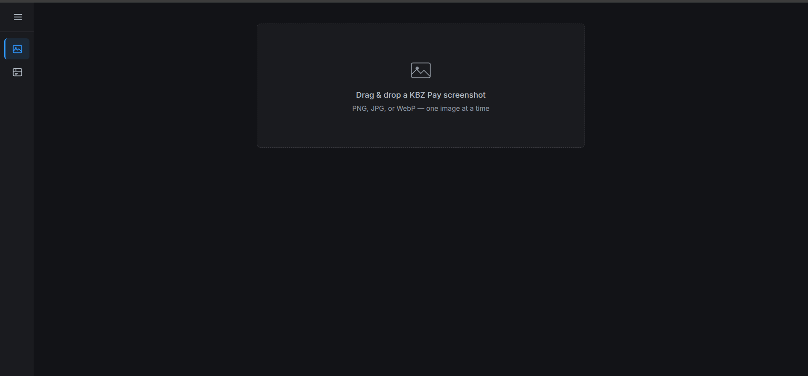
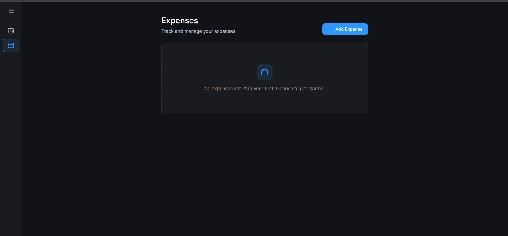
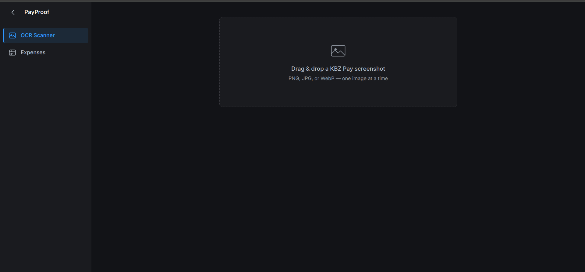

# PayProof

**OCR Payment Proof Connector + Expenses Tracker**

A privacy-first tool that reads KBZ Pay payment screenshots and extracts payment details automatically. Includes an expenses tracker with receipt attachment support.

---

## Features

- 🔍 **OCR Scanner** — Upload KBZ Pay screenshots, extract payment details automatically
- 📋 **Expenses Tracker** — Log expenses, attach receipts (upload or camera)
- 🎨 **Dark Theme** — Google AI Studio-inspired Material 3 design
- 📱 **Responsive** — Mobile, tablet, desktop
- 🔒 **Privacy-first** — All processing on-device, zero cloud dependency

---

## Tech Stack

| Layer | Technology |
|---|---|
| **Frontend** | React 19 + TypeScript + Vite + Tailwind CSS 4 |
| **Backend** | Python FastAPI + EasyOCR + OpenCV |
| **Database** | SQLite + SQLAlchemy (backend), localStorage (frontend) |

---

## Quick Start

```bash
# Backend
cd backend && source .venv/bin/activate && uvicorn app:app --port 8765

# Frontend (another terminal)
cd frontend && npm install && npm run dev
```

Open http://localhost:5173

---

## Project Structure

```
payproof/
├── SPEC.md                  # SDD 6-part spec
├── CLAUDE.md                # Project memory for Claude Code
├── .mcp.json                # MCP tools config
├── .claude/                 # Skills + Agents
├── backend/                 # FastAPI + EasyOCR
├── frontend/                # React + Vite app
├── docs/                    # Screenshots
└── slides.md                # Marp 6×20 presentation
```

---

## Screenshots

| OCR Scanner | Expenses Tracker | Sidebar Navigation |
|:-----------:|:----------------:|:------------------:|
|  |  |  |

---

## License

MIT
